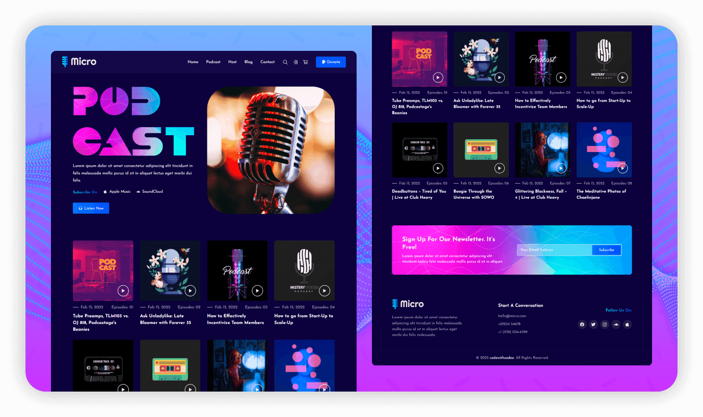

   
   
  
  

  <h2 align="center">Micro - Site de podcast</h2>

  Micro é um site de Podcast totalmente responsivo,  responsivo para todos os dispositivos, construído usando HTML, CSS e JavaScript.

  <a href="https://ichumbo.github.io/Landing-page-Audio/"><strong>➥ Demonstração ao vivo</strong></a>

 

### Capturas de tela de demonstração

### Contato

Se você quiser entrar em contato comigo, pode entrar em contato comigo em [Twitter](https://twitter.com/IanMelw).

### Licença

Este projeto é **de uso gratuito** e não contém nenhuma licença.
